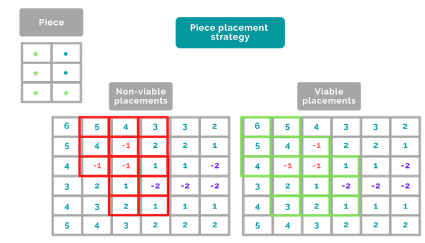
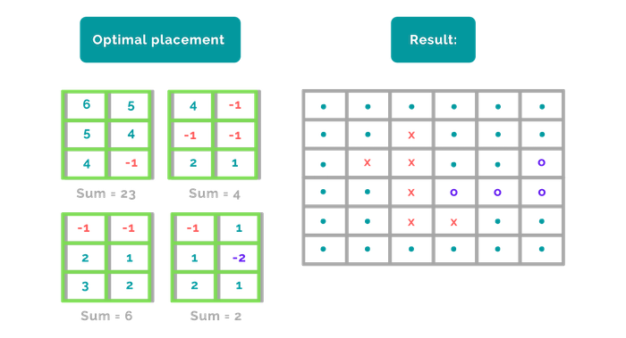

# Filler
✅  Project score: 100/100  ✅  
Filler is a two-player algorithmic game. Your aim is to build an algorithm that fills as much space as possible on a given grid using randomly generated pieces of different sizes and shapes. The pieces cannot be stacked in a way where more than one square falls on top of another and the pieces you place cannot fall on top of the opponent's pieces, either. If any of this happens or any of your pieces fall outside the grid, the game ends. Each successfully placed piece yields points - the goal of the game being to get as many points as possible before the game ends.
  
I used a heatmap to help my program find the optimal place to place a piece. For each round of the game that's played, my program first converts the map received from the filler VM into heatmap by changing '.'s into '0's, and the letters 'o', 'O', 'x' and 'X' to either '-1' (always used to represent my programs' pieces on the map) and '-2' (always used to represent the opponents' pieces on the map). Next, for each coordinate-combo in the heatmap that has '0' value, a new int value is assigned to it based on its relative position to the nearest opponent-owned coordinate:

